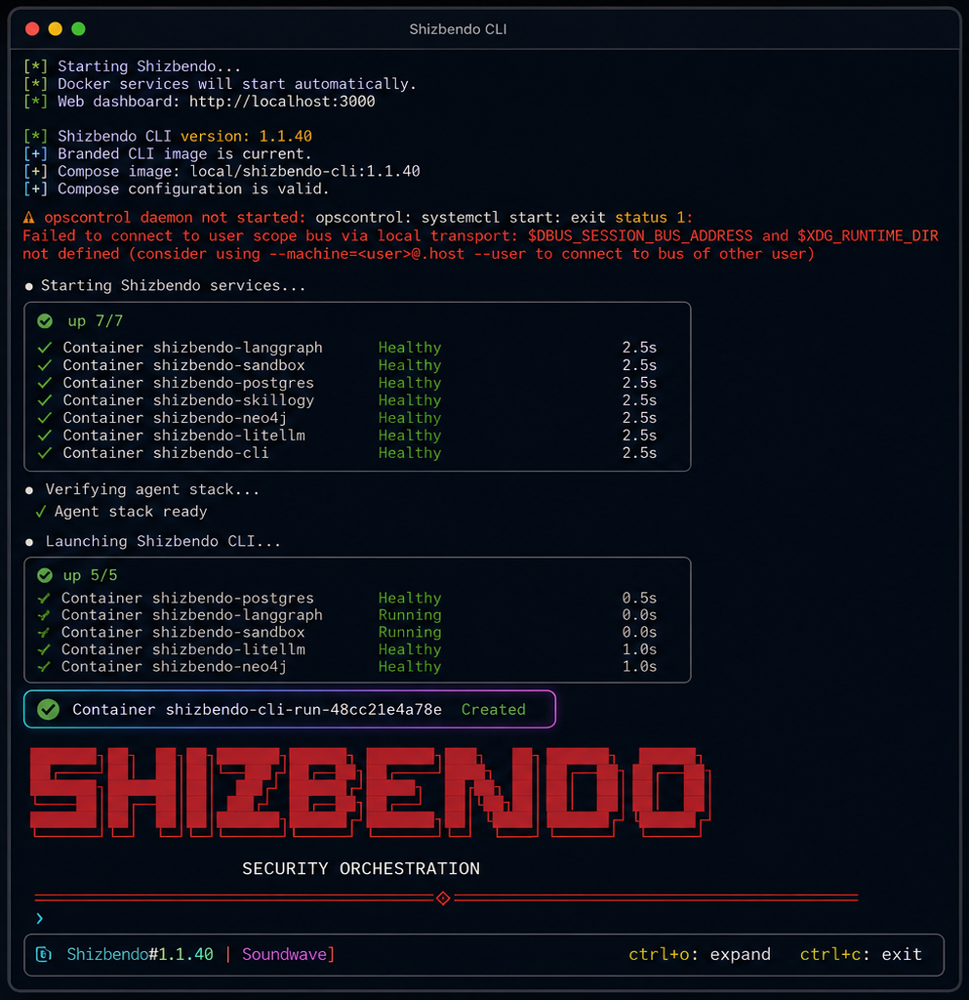

# Shizbendo

Shizbendo is a branding and terminal-launcher customization layer for
the Decepticon autonomous security platform.

## Preview

## Features

- SHIZBENDO terminal ASCII logo
- `Shizbendo — pick an engagement`
- `[Shizbendo#VERSION | Soundwave]`
- Display-only `shizbendo-*` service names
- AI-provider selection launcher
- Persistent branded Docker CLI image
- Interactive PTY output wrapper
- Compatibility with existing engagements

## Architecture

Shizbendo changes visible terminal output. Internal identifiers remain
unchanged so Docker Compose networking, environment variables, health
checks, volumes, and engagements continue to work.

Examples of unchanged internal identifiers:

    DECEPTICON_*
    decepticon-langgraph
    decepticon-postgres
    decepticon-neo4j
    decepticon-litellm
    decepticon-sandbox

## Requirements

- Linux
- Docker and Docker Compose v2
- Python 3
- Root or sudo access
- An installed and configured upstream Decepticon runtime

Tested with Decepticon 1.1.40 on Kali Linux ARM64.

## Install

    git clone https://github.com/shezbendo0o0o/shizbendo.git
    cd shizbendo
    sudo ./install.sh

## Start

    sudo shizbendo

## Update

    cd shizbendo
    git pull
    sudo ./install.sh

## Uninstall the customization

    cd shizbendo
    sudo ./uninstall.sh

The uninstaller restores files that existed before Shizbendo was
installed. It does not delete upstream engagement data or Docker data.

## Security

This repository intentionally excludes API keys, `.env` files, OAuth
credentials, engagement workspaces, databases, Docker volumes, and the
upstream launcher binary.

Never commit `/root/.decepticon/.env`.

Use this software only on systems and networks for which you have
explicit authorization.

## Upstream attribution

Shizbendo is a customization layer for Decepticon by PurpleAILAB:

    https://github.com/PurpleAILAB/Decepticon

Shizbendo is not affiliated with or endorsed by PurpleAILAB.

## License

Apache License 2.0. See `LICENSE` and `NOTICE`.
